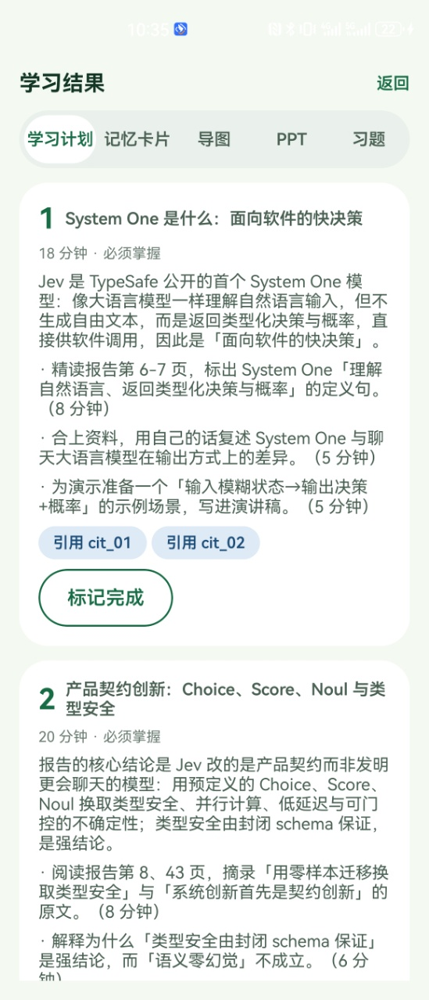
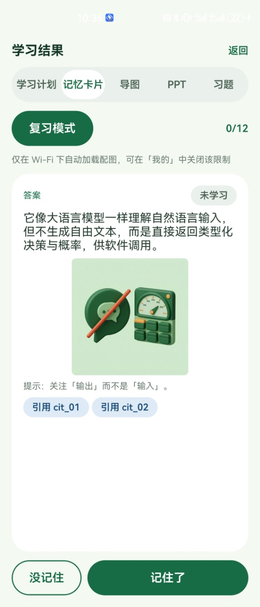
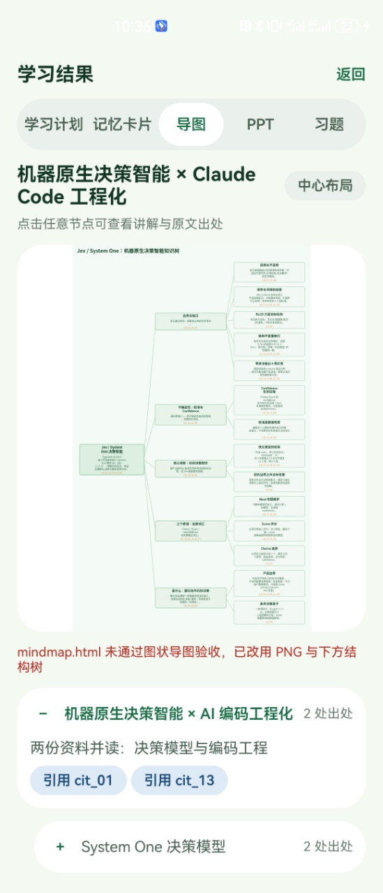
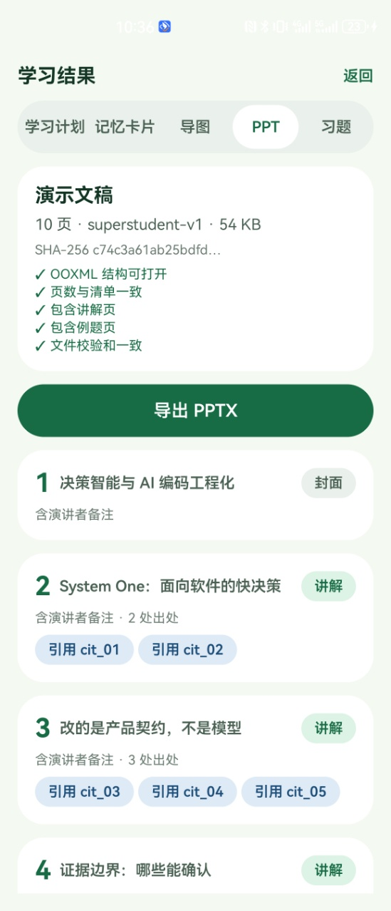
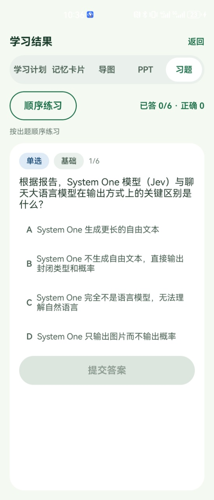

# SuperStudent

> 一个基于 **Qoder Cloud Agents（QCA）** 平台的场景化 Demo —— 原生 Android 学习助手。
> An Android demo app that orchestrates a cloud QCA agent to turn study materials into five structured learning artifacts.

## 这是什么 / What is this

SuperStudent 演示了「**原生 App ↔ 云端 Agent**」的一种典型协作范式：手机端只负责采集学习资料、下发任务、渲染结果；真正的「理解资料 → 生成学习产物」全部交给 QCA 平台上配置好的一个 **Template（云端 Agent）** 完成。App 通过 **QCA Forward API** 与云端通信，产物存放在 QCA 的 **drive** 里，再回传到手机渲染。

它想回答的问题是：*如何把一个云端 Agent 的能力，稳妥地嵌进一个真实的移动端产品* —— 包括任务下发、进度观察（SSE）、产物严格验收、失败回退与离线渲染。

### 适用范围 / Scope

- 这是 QCA 平台的**场景 Demo**，用于展示云端 Agent 与移动端的集成范式，**不是**生产级学习应用。
- **已实现**：登录（PAT + 用户名）、学习包管理、资料上传（文件/图片/粘贴文本）、云端生成任务、五类结果渲染与导出。
- **占位/未实现**：底部导航的「首页」「圈子」为占位页（显示"功能即将上线"）；「学习」Tab 仅做课程外链跳转。
- 界面文案与生成内容均为**中文**。

## 五类学习产物 / The five artifacts

上传资料并触发生成后，云端 Agent 产出五种结构化结果，App 分 Tab 渲染：

| Tab | 产物 | 云端产出文件 |
|---|---|---|
| 学习计划 | 分主题学习路径（难度 / 优先级 / 预计时长 / 任务 / 前置依赖 / 引用） | `plan.json` |
| 记忆卡片 | ≥5 张卡片（定义 / 公式 / 易混 / 例题），可选 ImageGen 配图 | `cards.json`（+ `cards/img/*.png`） |
| 导图 | **可交互 SVG 思维导图**（节点 / 连线 / 引用角标 + 折叠展开），HTML 契约 v2 | `mindmap.json` + `mindmap.html`（+ `mindmap.png` 兜底） |
| PPT | 16:9 演示文稿（`python-pptx` 生成）+ 每页讲者备注 | `deck.pptx` + `deck.manifest.json` |
| 习题 | ≥3 题（单选 / 计算），含答案与分步解析 | `exercises.json` |

> 所有引用统一落在 `citations.json`；五类产物中出现的每个 `citationId` 都必须能在其中解析到（含定位符与原文摘录）。

## 截图 / Screenshots

<p>
  
  
  
  
  
</p>

从左到右：学习计划 · 记忆卡片 · 导图 · PPT · 习题。

## 代码里**不包含**什么 / What the code does NOT contain

这是本 Demo 最需要说明的部分 —— 以下内容**不在仓库里**，需要你在 QCA 平台侧自行准备：

1. **云端 Template 配置**（模型、skills、工具、Vault、沙箱环境）——它们存在于 QCA 平台，不随代码分发。App 里只留了一个 Template ID 占位符（`app/src/main/java/com/superstudent/app/AppContainer.kt` 的 `TEMPLATE_ID`），构建前需替换成你自建的 Template ID。
   → 如何配置、配了哪些 skill/工具、功能如何对应：见 **[docs/qca-template-setup.md](docs/qca-template-setup.md)**。
2. **任何凭证**——PAT（访问令牌）在 App 首次登录时由用户输入，存进 Android Keystore（AES-256-GCM）。仓库里没有、也永远不会有 PAT / token / keystore / 用户名。
3. **云端沙箱环境本身**——生成 PPT 用的 `python-pptx`、`qmind-knowledge` 技能 CLI、ProcessOn 脑图能力等，都由 QCA 的沙箱环境 + Vault 提供，不在代码里。
4. **内部设计文档与 issue 追踪**——源码注释里大量出现 `ZLQ-xxx` 编号，指向一个**私有** issue 追踪系统与设计文档，公开仓库不包含它们。`docs/upload-failure-contract.md` 同属内部契约文档，保留仅供参考。

## 架构概览 / Architecture

单 Activity + Jetpack Compose，多模块 Gradle 工程：

| 模块 | 职责 |
|---|---|
| `:app` | Compose UI、功能特性、DI 容器、任务运行器（`TaskRunner`）、生成契约（`PromptTemplate`） |
| `:core:model` | 纯 Kotlin DTO / 枚举 / 结果 JSON schema + 严格校验器 `ResultValidator`（含导图 HTML 契约 v2） |
| `:core:network` | QCA Forward API 的 Retrofit/OkHttp 层、SSE 观察、预签名传输、错误映射 |
| `:core:database` | Room（schema v1–v4）、DataStore、Drive 仓库、各业务仓库 |
| `:core:security` | Keystore PAT 存储、PAT 校验、用户名归一化、哈希 |
| `:core:designsystem` | Compose 主题 / 令牌 / 组件 |

技术栈：Kotlin 2.2.10 · AGP 9.4.1 · Compose BOM 2026.09.00 · compileSdk 37 / minSdk 28 · Java 17 · OkHttp 5.5.0 · Retrofit 3.0.0 · Room 2.8.5 · kotlinx-serialization 1.9.0 · Coil 3.3.0 · jsoup 1.18.3 · WorkManager 2.12.0。

详见 → **[docs/architecture.md](docs/architecture.md)**。

## 快速开始 / Quick start

```bash
# 前置：JDK 17、Android SDK（platform 37）
./gradlew assembleDebug     # 产出 app/build/outputs/apk/debug/*.apk
./gradlew test              # 全模块单元测试（仅 JVM 单测，无 androidTest）
```

完整的「配置云端 Template → 获取 PAT → 构建 → 登录 → 生成 → 查看结果」步骤见 → **[docs/build-and-run.md](docs/build-and-run.md)**。

> ⚠️ **重要**：仓库里 `AppContainer.kt` 的 `TEMPLATE_ID` 是一个**占位符**（`tmpl_REPLACE_WITH_YOUR_TEMPLATE_ID`），不含任何真实账号信息。要真正跑通生成，你必须在 QCA 上**自建一个 Template**（配好等价的 skill + 工具 + Vault + 沙箱环境），把它的 ID 替换进 `TEMPLATE_ID`，并用**你自己的 PAT** 登录。详见 build-and-run 文档。

## 许可 / License

当前仓库尚未指定开源许可证。若你打算公开或再分发，请先补充 `LICENSE`（例如 Apache-2.0）。
